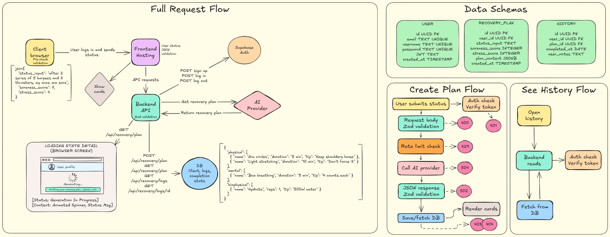

# Recovery App

> Input your pain, output your path to recovery — optimized across physical, mental, and biophysical needs.

## 🚀 Overview
This app translates your daily symptoms into a personalized, holistic recovery plan. By categorizing actionable advice into mental, physical, and biophysical protocols, it replaces guesswork with data-driven guidance to help you heal more effectively.

## 🏗️ Architecture
Here is a high-level overview of how the system works:



## 🛠️ Getting Started
### Prerequisites
This project is built using a full-stack TypeScript architecture.

### Backend
* **[Node.js](https://nodejs.org/)**: The runtime environment.
* **[Express](https://expressjs.com/)**: Fast, unopinionated web framework for building the API.
* **[CORS](https://www.npmjs.com/package/cors)**: Middleware for handling cross-origin requests between the client and server.
* **[TypeScript](https://www.typescriptlang.org/)**: Static typing for backend logic.

### Frontend
* **[Vite](https://vitejs.dev/)**: Frontend build tool for fast development.
* **[React](https://react.dev/)**: The UI library for building the interface.
* **[Tailwind CSS](https://tailwindcss.com/)**: Utility-first CSS framework for styling.
* **[TypeScript](https://www.typescriptlang.org/)**: Static typing for type-safe components.

### Installation
```bash
# Clone the repository
git clone https://github.com/ritafernm/recovery-app.git

# Install dependencies
npm install